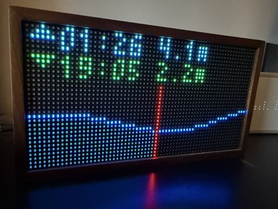
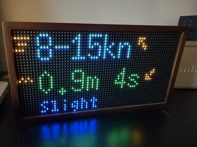

# ukho-tides-pixlet

Display UK tide times on your [Tidbyt](https://tidbyt.com) using the [UKHO Admiralty Tidal API](https://admiraltyapi.portal.azure-api.net).

Shows a tide curve chart with the current tidal state shaded in blue, plus the next high and low tide times and heights.

| Tides | Wind & Swell |
|-------|--------------|
|  |  |

## Setup

### 1. Get API keys

- **Admiralty API key**: Sign up for a free Discovery account at https://admiraltyapi.portal.azure-api.net
- **Tidbyt credentials**: Open the Tidbyt mobile app → Settings → Get API key

### 2. Find your station ID

Browse https://easytide.admiralty.co.uk to find your station. Default is `0020` (Salcombe).

### 3. Run with Docker

```bash
docker run -d --name ukho-tides-pixlet --restart unless-stopped \
  -e ADMIRALTY_API_KEY=xxx \
  -e TIDBYT_DEVICE_ID=xxx \
  -e TIDBYT_API_TOKEN=xxx \
  ghcr.io/lewispb/ukho-tides-pixlet:latest
```

The container pushes updates to your Tidbyt every 15 minutes.

### 4. Run locally

```bash
bundle install
ADMIRALTY_API_KEY=xxx TIDBYT_DEVICE_ID=xxx TIDBYT_API_TOKEN=xxx ruby bin/push
```

Requires Ruby and ImageMagick.

## Unraid

An Unraid Docker template is included. Add the container via the Docker tab and fill in your credentials.

## Configuration

| Variable | Required | Default | Description |
|----------|----------|---------|-------------|
| `ADMIRALTY_API_KEY` | Yes | — | UKHO API subscription key |
| `TIDBYT_DEVICE_ID` | Yes | — | Tidbyt device ID |
| `TIDBYT_API_TOKEN` | Yes | — | Tidbyt API token |
| `STATION_ID` | No | `0020` | UKHO station ID (0020 = Salcombe) |
| `PUSH_INTERVAL_SECONDS` | No | `900` | Seconds between pushes (default 15 min) |
